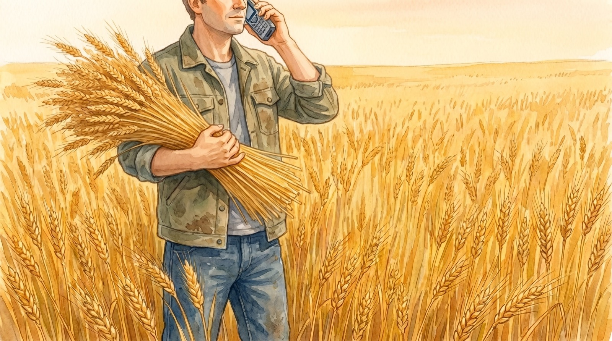

# graincrawl 🌾 — Granola, gathered locally.



[](https://github.com/openclaw/graincrawl/actions/workflows/ci.yml)
[](https://github.com/openclaw/graincrawl/releases/latest)
[](https://go.dev/)
[](LICENSE)
[](https://github.com/openclaw/homebrew-tap/blob/main/Formula/graincrawl.rb)

`graincrawl` creates a private, local SQLite archive of Granola notes, transcripts, panels, people, workspaces, and sync metadata. It is for people who want searchable, exportable meeting data without writing to their Granola profile.

## Install

With Homebrew:

```bash
brew install openclaw/tap/graincrawl
```

From source (Go 1.26.5 or newer):

```bash
go install github.com/openclaw/graincrawl/cmd/graincrawl@latest
```

## Quick start

Initialize the local config and archive, inspect the available Granola state, then sync:

```bash
graincrawl init
graincrawl doctor
graincrawl sync
graincrawl status
graincrawl notes
graincrawl tui
```

`sync` uses the configured source, which defaults to Granola's private desktop API session. When that session is unavailable and a readable plaintext desktop cache exists, an implicit sync falls back to the cache.

## Sources and archive contents

The default private API source archives notes, transcripts, panels, people, workspaces, and retained source payloads. The desktop cache provides an offline fallback when `cache-v6.json` is readable. Both sources are read-only against Granola; graincrawl writes only to its own config, cache, and SQLite archive.

Granola 7.427 and later can store its data-encryption key in an app-scoped Keychain item that graincrawl cannot access. `graincrawl doctor` detects this boundary. Existing archived data stays readable, and a source with usable plaintext state still works. See the [security model](docs/security.md) for the exact source and legacy encrypted-JSON behavior.

## Find and export notes

Search the archive, inspect one note, or export Markdown:

```bash
graincrawl search "decision"
graincrawl note get <id>
graincrawl transcripts get <id>
graincrawl export markdown --out ./granola-notes
```

For automation, put `--json` before the command. The SQL surface is read-only:

```bash
graincrawl --json status
graincrawl --json notes
graincrawl --json sql "select count(*) as notes from notes"
```

## Portable snapshots

Snapshots move the archive between machines without touching the live Granola profile:

```bash
graincrawl snapshot create --out ./graincrawl-snapshot
graincrawl import ./graincrawl-snapshot
```

Imports merge by default and keep existing local payloads on identity conflicts. `graincrawl import --replace ./graincrawl-snapshot` performs an exact restore and removes rows that are absent from the snapshot.

See the [command reference](docs/commands.md) for every command, flags, JSON output, and shell completion.

## Configuration

`graincrawl init` writes a private config file and creates the archive directories. Use `--config <path>` or `GRAINCRAWL_CONFIG` to select another config, and start from [`config.example.toml`](config.example.toml) when you need custom source, path, sync, or security settings.

Passive update checks run at most once every 24 hours during interactive use. They are skipped for JSON output, CI, non-terminal stderr, and development builds. Set `GRAINCRAWL_NO_UPDATE_CHECK=1` or `CRAWLKIT_NO_UPDATE_CHECK=1` to disable them.

Release packaging and verification are documented in [docs/distribution.md](docs/distribution.md).

## Development

```bash
make build
make check
```

Contributions must preserve graincrawl's read-only boundary. See [CONTRIBUTING.md](CONTRIBUTING.md).

## License

MIT. See [LICENSE](LICENSE).
